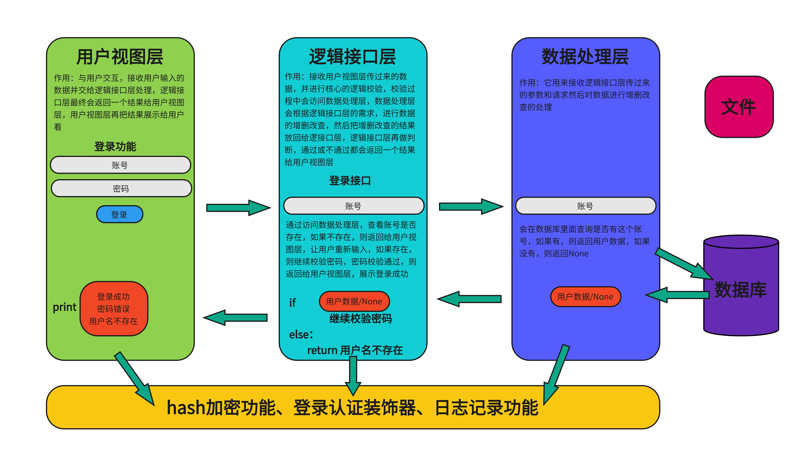

# 购物管理系统

## 需求

    1。 支持多账户登录						-- 登录功能
    2. 初始账户为0                             -- 注册功能
    3. 提供充值接口充值后才可消费   -- 充值功能
    4. 实现购物功能，可加入购物车，使用账户余额结账  -- 购物功能、支付功能
    5. 实现提现功能，手续费10% --  提现功能
    6. 实现账户间转账  -- 转账功能
    7. 实现日常消费流水  -- 记录流水功能
    8. 记录日常操作日志  -- 记录日志功能
    9. 提供管理接口，包括账号，冻结账号，给用户充等  -- 管理员功能
    10. 用户登录用装饰器
    
    
    
    用户视图展示功能：
    0、退出
    1、注册功能
    2、登录功能
    3、转账功能
    4、充值功能
    5、提现功能
    6、查看余额
    7、查看余额
    8、购物功能
    9、查看购物车
    10、退出账号
    11、管理员功能

## 标题

 
